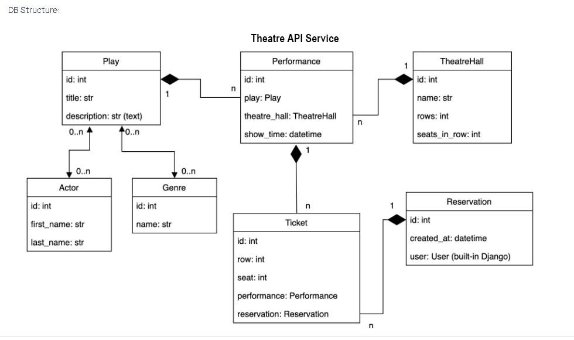

# Documentation Theatre API Service

Theatre API Service (CRUD application) is an application that implements user interaction and the ability for the user
to reserve tickets for a play.

## DB Structure:

1. User (Authenticated user with JWT authorization)
2. CRUD operations with actor, genre, play, performance, theatre hall, reservation
3. Checking reservations for rows and seats per play.
4. Utilization of Docker to create and deploy the application, 
including a PostgreSQL database (via docker-compose.yml).

## Setup:

### Option with Docker:

1. Install Docker ( [Link](https://www.docker.com/products/docker-desktop/) ) if you don't have it installed
2. Clone the project:
    + `git clone https://github.com/IhorVoskoboinikov/theatre-api-service`
3. Add file .env (look for example in .env.sample):
4. Create Docker images:
    + `docker-compose build`
5. Run app:
    + `docker-compose up`

## Usage (local):

1. Go to the URL where the API was
   launched: [http://127.0.0.1:8000/api/doc/swagger/](http://127.0.0.1:8000/api/doc/swagger/), and use Swagger to test
   the API endpoints.

